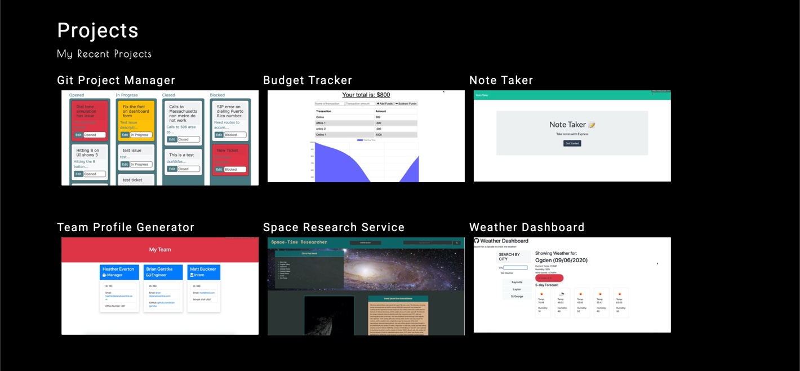
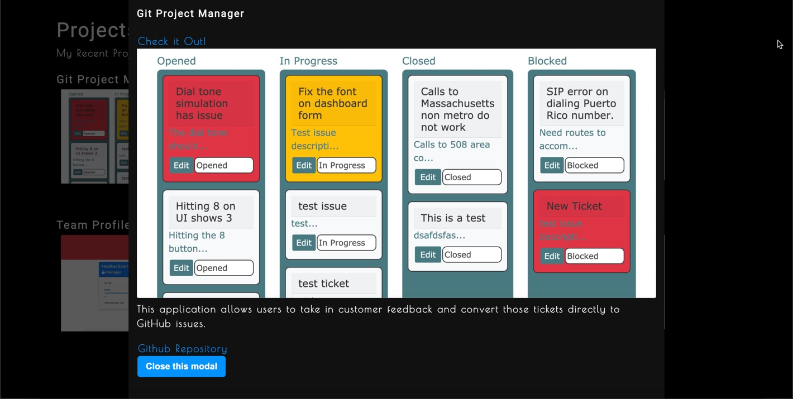
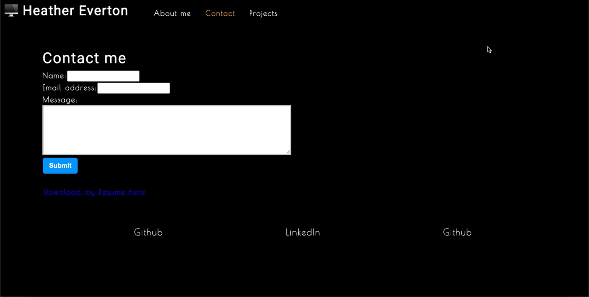

# portfolio2

## Description
This is a my professional portfolio to allow employers to learn more about me, view my projects, and download my resume. 

For each project you can see a simple screenshot of the project but also access the project online or access the github repo to review the code. 

If you're interested in contacting me or downloading my resume you also have the option get get in touch. 

<a href="https://github.com/heather-everton/portfolio2"><strong>Explore the docs »</strong></a>
 
<a href="https://heather-everton.github.io/portfolio2"><strong>Access the hosted application here</strong></a>
 

## Table of Contents
* [Installation](#installation)
* [Contributing](#contributing)
* [Tests](#tests)
* [Questions](#questions)

## Installation
We used react and react-download-link on this project so install both
npm install
npm install react
npm install react-download-link

## Contributing
If you're interested in contributing please reach out to me via email. 

## Tests
We're using jest to test this application. test cases and snapshots have been generated for this project. 

## Questions
If you have any questions about the repo, open an issue or contact me directly at heathereverton88@gmail.com. You can find more of my work at (https://github.com/heather-everton/).

### Built With
* [react](https://reactjs.org/)
* [express](https://expressjs.com/)
* [node](https://nodejs.org/en)

## Roadmap

See the [open issues](https://github.com/heather-everton/portfolio2/issues) for a list of proposed features (and known issues).
